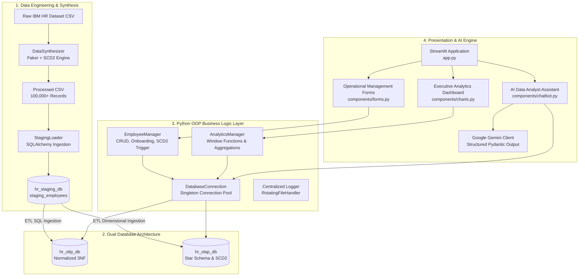

# 🏢 Enterprise HR Analytics & Data Warehouse Platform

[](https://www.python.org/)
[](https://streamlit.io/)
[](https://www.mysql.com/)
[](https://ai.google.dev/)
[](https://plotly.com/)
[](#-system-architecture)

An end-to-end Enterprise HR Analytics, Operational Management (OLTP), Data Warehousing (OLAP Star Schema with SCD Type 2), and AI-Powered Natural Language SQL Query platform.

---

## 📌 Table of Contents

- [Overview](#-overview)
- [System Architecture](#-system-architecture)
- [Database Modeling & Schemas](#-database-modeling--schemas)
  - [1. OLTP Operational Schema (3NF)](#1-oltp-operational-schema-3nf)
  - [2. OLAP Dimensional Star Schema](#2-olap-dimensional-star-schema)
  - [3. Slowly Changing Dimensions (SCD Type 2)](#3-slowly-changing-dimensions-scd-type-2)
- [Key Features & Modules](#-key-features--modules)
  - [📊 Executive Analytics (OLAP)](#-executive-analytics-olap)
  - [📝 Operational Management (OLTP)](#-operational-management-oltp)
  - [💬 AI Data Analyst Assistant](#-ai-data-analyst-assistant)
  - [⚡ Synthetic Data Engine & Pipeline](#-synthetic-data-engine--pipeline)
- [Project Directory Structure](#-project-directory-structure)
- [Technology Stack](#-technology-stack)
- [Installation & Setup Guide](#-installation--setup-guide)
  - [Step 1: Clone and Create Environment](#step-1-clone-and-create-environment)
  - [Step 2: Configure Environment Variables](#step-2-configure-environment-variables)
  - [Step 3: Initialize MySQL Databases](#step-3-initialize-mysql-databases)
  - [Step 4: Synthesize Data & Ingest into Staging](#step-4-synthesize-data--ingest-into-staging)
  - [Step 5: Populate OLTP & OLAP Warehouses](#step-5-populate-oltp--olap-warehouses)
  - [Step 6: Launch Streamlit Dashboard](#step-6-launch-streamlit-dashboard)
- [Configuration Reference](#-configuration-reference)
- [Security & AI Guardrails](#-security--ai-guardrails)
- [Logging & Monitoring](#-logging--monitoring)
- [Troubleshooting & FAQ](#-troubleshooting--faq)

---

## 🌟 Overview

Modern enterprise HR systems require both low-latency transactional operations (onboarding employees, updating roles, recording reviews) and high-performance analytical capabilities across massive historical datasets. 

This platform bridges the gap between **Transactional Processing (OLTP)**, **Analytical Warehousing (OLAP)**, and **Generative AI**:
- **Scalable Data Synthesis**: Synthesizes and expands base IBM HR data into 100,000+ realistic employee lifecycles with career transitions and salary histories using Faker and statistical modeling.
- **Dual Database Architecture**: Separate normalized OLTP database for day-to-day operations and a Kimball star-schema OLAP warehouse for high-speed executive queries.
- **Automated SCD Type 2 Tracking**: Stored procedures and backend triggers automatically preserve historical audit trails whenever an employee changes departments, roles, or compensation.
- **AI-Powered Natural Language SQL Interface**: Integrated Google Gemini AI engine converting plain English prompts to optimized, schema-aware SQL queries with multi-layer security guardrails and automatic query healing.

---

## 🏗 System Architecture



---

## 🗄 Database Modeling & Schemas

### 1. OLTP Operational Schema (3NF)
The OLTP database (`hr_oltp_db`) is normalized to 3NF for ACID compliance and transactional data integrity:

- **`DEPARTMENTS`**: `department_id` (PK), `department_name`, `location`
- **`JOBS`**: `job_id` (PK), `job_role`, `job_level`, `uq_job(job_role, job_level)`
- **`EMPLOYEES`**: `employee_id` (PK), `first_name`, `last_name`, `email`, `phone_number`, `age`, `gender`, `marital_status`, `education`, `education_field`, `hire_date`, `department_id` (FK), `job_id` (FK), `manager_id` (Self FK), `monthly_income`, `attrition`, `distance_from_home`, `total_working_years`
- **`PROJECTS`**: `project_id` (PK), `project_name`, `department_id` (FK), `start_date`, `end_date`, `budget`
- **`PROJECT_ASSIGNMENTS`**: `assignment_id` (PK), `employee_id` (FK), `project_id` (FK), `role_in_project`, `allocation_percentage`, `assigned_date`
- **`PERFORMANCE_REVIEWS`**: `review_id` (PK), `employee_id` (FK), `review_date`, `environment_satisfaction`, `job_satisfaction`, `relationship_satisfaction`, `job_involvement`, `performance_rating`, `percent_salary_hike`

### 2. OLAP Dimensional Star Schema
The Data Warehouse (`hr_olap_db`) optimizes query latency for executive aggregations and point-in-time trend analysis:

```
                  +-------------------------+
                  |     Dim_Department      |
                  +-------------------------+
                  | * dept_key (PK)         |
                  |   department_id (BK)    |
                  |   department_name       |
                  |   location              |
                  +------------+------------+
                               |
                               | 1:N
                               v
+-----------------------+     +-------------------------------+     +-------------------------+
|     Dim_Employee      |     |    Fact_PerformanceReviews    |     |       Dim_Project       |
+-----------------------+     +-------------------------------+     +-------------------------+
| * emp_key (PK)        |<--->| * review_fact_id (PK)         |<--->| * project_key (PK)      |
|   employee_id (BK)    | 1:N |   emp_key (FK)                | N:1 |   project_id (BK)       |
|   full_name           |     |   dept_key (FK)               |     |   project_name          |
|   email               |     |   project_key (FK)            |     |   start_date / end_date |
|   job_role / level    |     |   review_date_key (FK)        |     |   budget                |
|   monthly_income      |     |   performance_rating          |     +-------------------------+
|   effective_start_date|     |   percent_salary_hike         |
|   effective_end_date  |     |   environment_satisfaction    |
|   is_current (0/1)    |     |   job_satisfaction            |
|   change_reason       |     |   relationship_satisfaction   |
|   attrition           |     |   monthly_income              |
+-----------------------+     +---------------+---------------+
                                              |
                                              | N:1
                                              v
                                  +-------------------------+
                                  |        Dim_Date         |
                                  +-------------------------+
                                  | * date_key (PK YYYYMMDD)|
                                  |   full_date             |
                                  |   year / quarter / month|
                                  |   day_of_month / week   |
                                  +-------------------------+
```

### 3. Slowly Changing Dimensions (SCD Type 2)
In `Dim_Employee`, historical changes in department, job role, or salary are tracked as new version rows rather than mutating in place:
- **`effective_start_date`**: Start date of this specific career/compensation state.
- **`effective_end_date`**: Expiration date (`9999-12-31` for current records, previous timestamp for expired ones).
- **`is_current`**: Binary flag (`1` for active, `0` for historical).
- **`change_reason`**: Promotion, department transfer, merit increase, or initial onboarding.
- **`sp_UpdateEmployeeSCD2`**: Stored procedure handling atomic record expiration and new version creation in `hr_olap_db`.

---

## ✨ Key Features & Modules

### 📊 Executive Analytics (OLAP)
Interactive analytical dashboard utilizing Plotly and Streamlit caching (`@st.cache_data(ttl=300)`):
- **Executive KPI Cards**: Active employee headcount, average performance rating, average monthly income, and company-wide job satisfaction.
- **Top Performers Window Ranking**: Evaluates SQL Window Functions `ROW_NUMBER() OVER (PARTITION BY department_name ORDER BY performance_rating DESC, percent_salary_hike DESC)` with horizontal rank-ordered visual bars.
- **Attrition Breakdown & Share**: Department-level attrition percentages dynamically calculated from `Dim_Employee`.
- **Low Satisfaction Risk Table**: Proactive early warning table filtering employees with `job_satisfaction <= 2` across department hierarchies.
- **Compensation Distributions**: Average monthly salary visual comparison across all enterprise job roles.

### 📝 Operational Management (OLTP)
Full-featured transactional UI powered by the Python OOP domain layer (`EmployeeManager`):
- **👤 Onboard Employee**: Validates input data, calculates next auto-incremented employee ID, and persists new personnel records into `EMPLOYEES`.
- **📁 Project Assignment**: Assigns employees to departmental projects with configurable roles and allocation percentages (10% - 100%).
- **🔄 Department / Role Update (SCD Type 2)**: Updates operational `EMPLOYEES` table and automatically triggers `sp_UpdateEmployeeSCD2` in the OLAP warehouse, preserving historical state and cache-invalidating downstream charts.
- **⭐ Performance Review**: Logs reviews in OLTP `PERFORMANCE_REVIEWS` and automatically synchronizes fact records to `Fact_PerformanceReviews`.

### 💬 AI Data Analyst Assistant
Intelligent text-to-SQL query engine leveraging **Google Gemini** (`google-genai`):
- **Schema-Aware Generation**: Automatically selects target database (`OLAP` by default, falling back to `OLTP` for operational-only attributes).
- **Structured Pydantic Enforcement**: Strict output validation generating `{target_db, sql_query, explanation}`.
- **Zero-Harm Security Filtering**: Enforces read-only execution (`SELECT` / `WITH` queries only) and blocks multi-statements or destructive DDL/DML keywords (`DROP`, `DELETE`, `UPDATE`, `INSERT`, `ALTER`, `TRUNCATE`, `CALL`).
- **Safety LIMIT Injection**: Automatically appends `LIMIT 100` if absent to protect UI rendering and database memory.
- **Self-Healing Error Recovery**: If a generated query encounters a MySQL syntax or runtime error, the engine dispatches the error trace back to Gemini with conversational context for automatic regeneration (up to 2 retries).

### ⚡ Synthetic Data Engine & Pipeline
- **Dataset Scaling**: Expands base IBM HR datasets up to 65,000+ unique employees (100,000+ total historical rows).
- **Realistic Identity Profiling**: Utilizes `Faker` to synthesize names, enterprise email patterns, and phone numbers.
- **Realistic SCD2 Career Transitions**: Simulates career progressions (~60% of employees have historical transitions including promotions, merit raises, and transfers).
- **High-Throughput Chunked Ingestion**: Efficient batch insertion into MySQL using SQLAlchemy and PyMySQL (`chunksize: 5000`).

---

## 📂 Project Directory Structure

```
v4c_mini_project_group_1/
├── app.py                      # Main Streamlit Application entry point & router
├── config.yaml                 # System paths, DB staging, and Gemini configuration
├── .env                        # Database connection credentials & API keys (Git ignored)
├── logger.py                   # Root logger entry point for script invocations
├── requirements.txt            # Python package dependencies
│
├── backend/                    # Python Backend & OOP Business Layer
│   ├── __init__.py
│   ├── config.py               # Environment variable loader and DB connection constants
│   ├── logger.py               # Centralized logging engine with RotatingFileHandler
│   ├── exceptions.py           # Custom application error hierarchy (AppError, etc.)
│   ├── entities.py             # Domain OOP classes (Employee, Project, Review)
│   ├── db_manager.py           # Thread-safe Singleton MySQL connection pool manager
│   ├── employee_manager.py     # OLTP transactional service (Onboard, Assign, Update, Review)
│   ├── analytics_manager.py    # OLAP analytical queries, KPIs, and window functions
│   └── test_connection.py      # Quick database connectivity test script
│
├── components/                 # Streamlit UI Components & Modules
│   ├── __init__.py
│   ├── forms.py                # OLTP Operational Management forms (Onboard, SCD2, Review)
│   ├── charts.py               # OLAP Executive Analytics charts, KPIs, and Plotly graphs
│   └── chatbot.py              # AI SQL Data Analyst (Gemini client, guardrails, Chat UI)
│
├── database/                   # Database Scripts & Ingestion Pipeline
│   ├── __init__.py
│   ├── synthesizer.py          # Synthetic data generator (Faker + SCD Type 2 simulation)
│   ├── load_staging.py         # Bulk ingestion from CSV into MySQL staging_employees
│   └── sql_scripts/            # Production DDL and DML scripts
│       ├── staging_script_mini_project.sql     # Creates hr_staging_db & staging_employees
│       ├── oltp_scripts_mini_project.sql       # Creates hr_oltp_db & populates from staging
│       ├── olap_scripts_mini_project.sql       # Creates hr_olap_db star schema & populates
│       └── stored_procedures_mini-project.sql  # sp_UpdateEmployeeSCD2 stored procedure
│
├── data/                       # Data storage directory
│   ├── raw/                    # Original IBM HR Analytics CSV dataset
│   └── processed/              # Synthesized 100k+ row CSV dataset with SCD2 history
│
└── logs/                       # Application logs directory
    └── app.log                 # Rotating log file (10MB per file, 5 backups)
```

---

## 🛠 Technology Stack

| Layer | Technologies |
|---|---|
| **Frontend / Presentation** | Streamlit, Plotly Express, HTML/CSS Components |
| **Backend / OOP** | Python 3.10+, Pydantic v2, Python Logging (`RotatingFileHandler`) |
| **Database Engines** | MySQL 8.0+ (`hr_staging_db`, `hr_oltp_db`, `hr_olap_db`) |
| **Database Drivers & ORM** | `mysql-connector-python`, `SQLAlchemy`, `PyMySQL` |
| **AI / Large Language Model** | Google Gemini (`google-genai` SDK, `gemini-2.5-flash` / `gemini-3.5-flash`) |
| **Data Processing & Synthesis** | `pandas`, `numpy`, `Faker`, `PyYAML` |

---

## 🚀 Installation & Setup Guide

### Step 1: Clone and Create Environment

```bash
# 1. Clone repository
git clone <repository-url>
cd v4c_mini_project_group_1

# 2. Create a virtual environment
python -m venv venv

# 3. Activate the virtual environment
# On macOS / Linux:
source venv/bin/activate
# On Windows:
# venv\Scripts\activate

# 4. Install required dependencies
pip install -r requirements.txt
```

### Step 2: Configure Environment Variables

Create or edit the `.env` file in the root project directory:

```ini
# MySQL Database Credentials
DB_HOST=localhost
DB_PORT=3306
DB_USER=root
DB_PASS=your_mysql_password
DB_NAME=hr_staging_db
DB_OLTP_NAME=hr_oltp_db
DB_OLAP_NAME=hr_olap_db

# Google Gemini API Key (Get from https://aistudio.google.com/)
GEMINI_API_KEY=your_gemini_api_key_here
```

### Step 3: Initialize MySQL Databases

Run the database creation and staging DDL scripts in MySQL:

```bash
# Run staging schema creation
mysql -u root -p < database/sql_scripts/staging_script_mini_project.sql
```

### Step 4: Synthesize Data & Ingest into Staging

Generate the 100,000+ synthetic employee history dataset and ingest it into `hr_staging_db`:

```bash
# 1. Generate synthesized dataset (writes to data/processed/synthesized_employee_data.csv)
python database/synthesizer.py

# 2. Ingest CSV records into staging_employees table in MySQL
python database/load_staging.py
```

### Step 5: Populate OLTP & OLAP Warehouses

Execute the ETL scripts to populate both schemas and create the SCD Type 2 stored procedures:

```bash
# 1. Populate Normalized OLTP Tables
mysql -u root -p < database/sql_scripts/oltp_scripts_mini_project.sql

# 2. Populate OLAP Star Schema Dimensions & Fact Tables
mysql -u root -p < database/sql_scripts/olap_scripts_mini_project.sql

# 3. Create SCD Type 2 Stored Procedure
mysql -u root -p < database/sql_scripts/stored_procedures_mini-project.sql
```

> **Verify Connection**: Run `python backend/test_connection.py` to confirm successful database connectivity.

### Step 6: Launch Streamlit Dashboard

Start the application UI:

```bash
streamlit run app.py
```

Open your browser at `http://localhost:8501`.

---

## ⚙ Configuration Reference

Configuration parameters in [`config.yaml`](file:///Users/architajha/Desktop/v4c_mini_project_group_1/config.yaml):

```yaml
# Data Paths Configuration
paths:
  raw_data: "data/raw/WA_Fn-UseC_-HR-Employee-Attrition.csv"
  processed_data: "data/processed/synthesized_employee_data.csv"

# Staging Database Ingestion Settings
database:
  staging_table: "staging_employees"
  chunksize: 5000

# Google Gemini LLM Settings
gemini:
  model_name: "gemini-2.5-flash"  # or gemini-3.5-flash
  temperature: 0.1                 # Low temperature for deterministic SQL generation
```

---

## 🔒 Security & AI Guardrails

The **AI Data Analyst** implements enterprise-grade guardrails to ensure safe and deterministic SQL execution:

1. **System Prompt Constraint**: Instructs Gemini with full DDL context, relationship keys, and explicit rules on when to target `hr_olap_db` vs. `hr_oltp_db`.
2. **Pydantic Schema Validation**: Enforces structured JSON output via `SqlQueryPayload`.
3. **Keyword Blacklist & Read-Only Check**: Rejects any queries containing keywords such as `DROP`, `DELETE`, `UPDATE`, `INSERT`, `ALTER`, `TRUNCATE`, `CREATE`, `GRANT`, `REVOKE`, `EXEC`, `CALL`, or `INTO OUTFILE`.
4. **Statement Injection Defense**: Rejects queries with multiple statements separated by semicolons.
5. **Memory Protection**: Automatically appends `LIMIT 100` to prevent memory exhaustion and UI lag.
6. **Automatic Query Healing**: Intercepts MySQL execution errors and feeds the error stack back into Gemini for retry and correction.

---

## 📜 Logging & Monitoring

The system features a centralized, production-ready logging framework ([`backend/logger.py`](file:///Users/architajha/Desktop/v4c_mini_project_group_1/backend/logger.py)):
- **Dual Destination**: Simultaneous output to stdout console and rotating file logs.
- **Rotation Policy**: Maximum 10 MB per file, maintaining up to 5 historical backup files (`logs/app.log`, `app.log.1`, etc.).
- **Log Levels**: Configurable via `LOG_LEVEL` environment variable (`DEBUG`, `INFO`, `WARNING`, `ERROR`, `CRITICAL`).
- **Standard Format**: `[Timestamp] [LogLevel] [file:line] - Message`

---

## ❓ Troubleshooting & FAQ

<details>
<summary><b>1. Error: Access denied for user 'root'@'localhost'</b></summary>

- Verify your password in `.env` matches your MySQL root account password.
- Make sure special characters in the password are correctly escaped or handled by `urllib.parse.quote_plus`.
</details>

<details>
<summary><b>2. Error: Table 'hr_olap_db.Dim_Employee' doesn't exist</b></summary>

- Ensure you have executed `database/sql_scripts/olap_scripts_mini_project.sql` against your MySQL server.
- Verify that `DB_OLAP_NAME` in `.env` is set to `hr_olap_db`.
</details>

<details>
<summary><b>3. AI Data Analyst shows "Missing API Key" error</b></summary>

- Obtain an API key from [Google AI Studio](https://aistudio.google.com/).
- Add `GEMINI_API_KEY=your_key` to your `.env` file in the root folder and restart Streamlit.
</details>

<details>
<summary><b>4. Changes in OLTP forms are not immediately visible in Analytics charts</b></summary>

- The executive dashboard caches queries for 300 seconds for performance optimization.
- Actions performed in the Operational Management tab automatically trigger `st.cache_data.clear()`, but you can also use Streamlit's top-right menu **Clear cache** and **Rerun**.
</details>

---

## 👥 Authors & Acknowledgments

- **Project Group 1** - *Enterprise HR Analytics & DW Platform Mini Project*
- Base Dataset: *IBM HR Analytics Employee Attrition & Performance*
